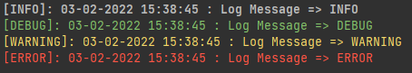

<h1>'Easy Logger' made Logging easy.</h1>

<h2>Log to files as well as to consoles.</h2>

<h4>This Project was made with my free time and will be released when i make changes to this project.</h4>

<h3>Initialize the IEasyLogger interface with the FileLogger Instance.</h3>


```c#
IEasyLogger easyLogger = new EasyFileLogger(Path.Combine(Environment.CurrentDirectory, "log.txt"));

//OR using Console Logger

IEasyLogger easyLogger = new EasyConsoleLogger();
```

```c#
// For ASP.NET Applications add EasyLogger to Service Collection Container. 
// By default uses Console logging
builder.Services.AddEasyLogger();

// Customize the Logging behaviour by providing options
builder.Services.AddEasyLogger(options =>
{
    options.FilePath = "./[EASYLOGGER].txt";
    options.LogOutputType = LogOutputType.WriteToFile;
});

// The DI service will inject IEasyLogger into your Controller's constructor
private readonly IEasyLogger _easyLogger;

public WeatherForecastController(IEasyLogger easyLogger) => 
    _easyLogger = easyLogger;
```


```c#
_easyLogger.Log("Log Message => INFO", LogType.Info);
_easyLogger.Log("Log Message => DEBUG", LogType.Debug);
_easyLogger.Log("Log Message => WARNING", LogType.Warning);
_easyLogger.Log("Log Message => ERROR", LogType.Error);
```
<h3>Console Screenshot of Logs</h3>


<h4>then Log with Message</h4>

```c#
/// <summary>
/// Logs the message
/// </summary>
/// <param name="message">The Message</param>
easyLogger.Log("HELLO WORLD");
```

or

```c#
/// <summary>
/// Logs the message
/// </summary>
/// <param name="message">The Message</param>
/// <param name="logType">Type of the Log</param>
easyLogger.Log(message: "HELLO WORLD", logType: LogType.Warning);
```

### Four types of Logging can be done

```c#
public enum LogType { Debug, Info, Warning, Error }
```